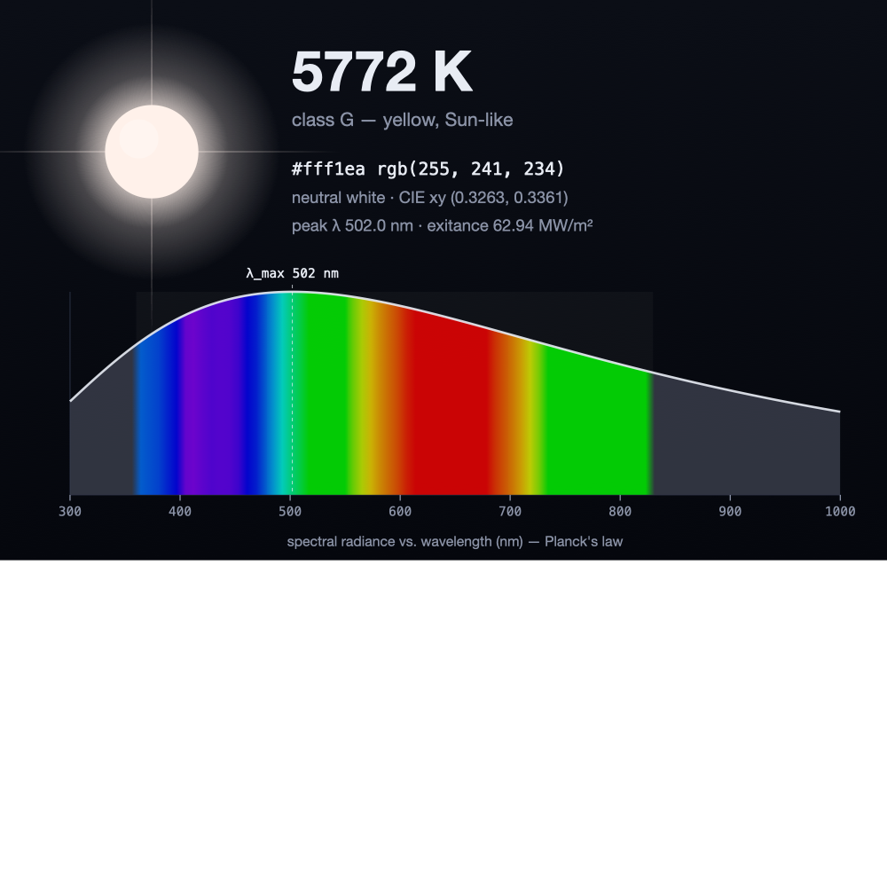
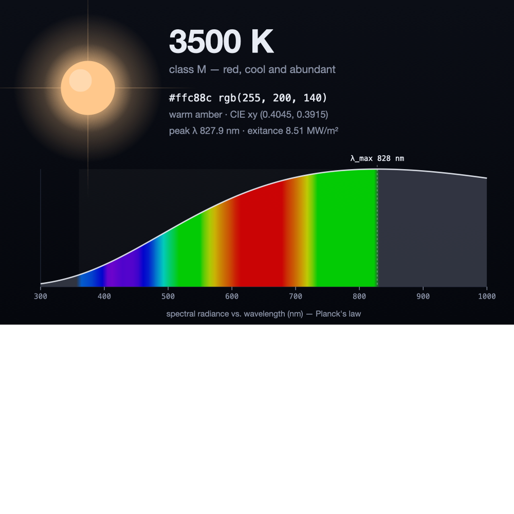
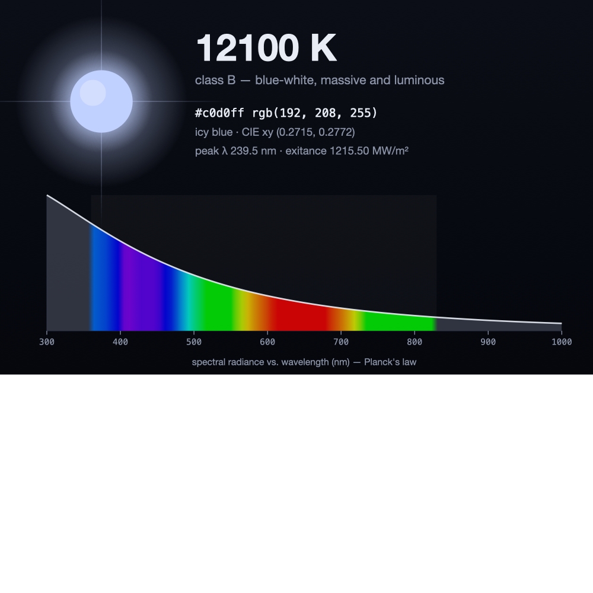
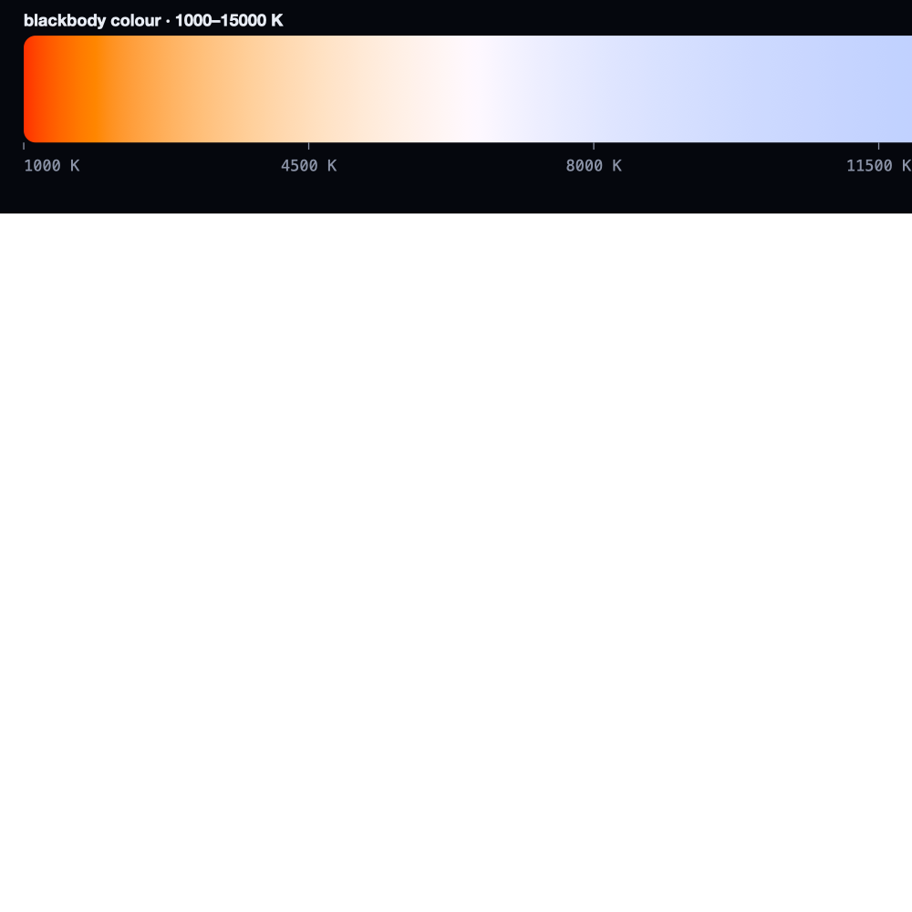

# starhue

**Temperature → the true colour of a star, plus the Planck spectrum behind it.**

Give `starhue` a temperature in kelvin and it returns the actual sRGB colour a
blackbody of that temperature would show your eye — derived properly, by
integrating the Planck curve against the CIE 1931 colour-matching functions —
together with the spectral curve, Wien peak, Stefan–Boltzmann output, and
spectral class. It renders all of this as a truecolor terminal card or a
gorgeous standalone SVG.

Pure Python standard library. **No dependencies.**

<p align="center">
  
</p>

---

## Quick start

The project folder *is* the `starhue` package, so you can run it straight from
source — from the directory that **contains** `starhue/`:

```bash
python -m starhue 5772            # the Sun
python -m starhue 3500 5772 12100 # several stars at once
python -m starhue --range 1000 12000   # a gradient strip across the locus
python -m starhue 5772 --svg sun.svg   # write a showcase SVG
python -m starhue 3500 --json          # machine-readable summary
```

```text
╭────────────────────────────────────────────────╮
│ ★  5772 K                              class G  │
│ ████████  #fff1ea  rgb(255, 241, 234)          │
│ yellow, Sun-like · neutral white               │
│                                                │
│ peak λ    502.0 nm  ·  3.393e+14 Hz            │
│ exitance  62.94 MW/m²                          │
│ CIE xy    (0.3263, 0.3361)                     │
│                                                │
│ ▄▄▅▆▆▇▇▇██████████▇▇▇▇▇▆▆▆▆▆▅▅▅▅▅▄▄▄▄▄▄▃▃▃▃▃▃▃ │
│            ▲                                    │
│ 300nm                                   1100nm │
╰────────────────────────────────────────────────╯
```

*(In a real terminal the swatch and spectrum sparkline are full 24-bit colour.)*

## Python API

```python
import starhue

# One-liners
starhue.temperature_to_hex(5772)     # '#fff1ea'
starhue.temperature_to_rgb(3500)     # (255, 200, 140)
starhue.temperature_to_xy(6500)      # (0.3134, 0.3239)  ≈ D65

# The high-level object
star = starhue.Star(5772)
star.hex                  # '#fff1ea'
star.rgb                  # (255, 241, 234)
star.chromaticity         # (0.3263, 0.3361)  CIE 1931 (x, y)
star.peak_wavelength_nm   # 502.0     — Wien's displacement law
star.peak_frequency_hz    # 3.39e14   — frequency-form Wien's law
star.radiant_exitance     # 6.29e7 W/m²  — Stefan–Boltzmann
star.spectral_type.letter # 'G'
star.appearance           # 'neutral white'
star.to_dict()            # everything, JSON-ready

# The raw spectrum: list of (wavelength_nm, radiance)
star.spectrum(380, 750, samples=100, normalize=True)
```

Lower-level physics and colour functions live in `starhue.physics` and
`starhue.color`:

```python
from starhue.physics import planck, wien_peak_wavelength, stefan_boltzmann
from starhue.color import temperature_to_rgb, wavelength_to_rgb, cie_1931_xyz
```

## The science

Everything is computed from first principles with the exact 2019-SI constants.

**Planck's law** — spectral radiance of a blackbody:

$$B_\lambda(T) = \frac{2hc^2}{\lambda^5}\,\frac{1}{\exp\!\left(\dfrac{hc}{\lambda k_B T}\right) - 1}$$

**Wien's displacement law** — where that curve peaks: $\lambda_\text{max} = b / T$.

**Stefan–Boltzmann law** — total power radiated per unit area: $j^\star = \sigma T^4$.

**Temperature → colour** follows the standard colorimetry pipeline:

1. Sample the Planck curve across the visible band (360–830 nm).
2. Integrate against the **CIE 1931 2° colour-matching functions** → CIE *XYZ*.
3. Map *XYZ* → linear sRGB with the D65 matrix.
4. Clamp out-of-gamut negatives, normalise to constant luminance, gamma-encode.

The colour-matching functions use the analytic multi-lobe Gaussian fit of
**Wyman, Sloan & Shirley (2013)**, which reproduces the tabulated CIE curves to
within ~1% with no embedded data table.

### Is it accurate?

Yes — it lands on the textbook reference points:

| Temperature | `starhue` | meaning |
|------------:|:----------|:--------|
| 6500 K | xy ≈ (0.313, 0.324) | essentially the **D65** white point |
| 5772 K | `#fff1ea` | the Sun — a warm white, *not* yellow |
| 3500 K | `#ffc88c` | amber (an M-type red giant) |
| 12000 K | bluish white | hot B-type star |

The full Planckian locus matches Mitchell Charity's well-known blackbody-colour
table closely.

## Gallery

A cool red giant — note the spectral peak sliding into the infrared:

<p align="center">
  
</p>

A hot blue star, peak pushed into the ultraviolet:

<p align="center">
  
</p>

The blackbody locus from ember-red to icy blue:

<p align="center">
  
</p>

## CLI reference

```
starhue [TEMPERATURES ...] [options]

positional:
  TEMPERATURES        one or more temperatures in kelvin (default: 5772, the Sun)

options:
  --range MIN MAX     render a gradient strip across this temperature range
  --steps N           number of steps in the gradient strip
  --svg PATH          write an SVG (a card for one temp, a strip for many)
  --json              emit a JSON summary instead of a card
  --no-spectrum       hide the spectrum sparkline in cards
  --color / --no-color   force or disable ANSI colour (auto-detected by default)
  --version
```

Colour output honours the `NO_COLOR` and `FORCE_COLOR` conventions.

## Module map

| module | role |
|---|---|
| `constants` | exact SI / CODATA physical constants |
| `physics` | Planck's law, Wien's law, Stefan–Boltzmann, spectrum sampling |
| `color` | CIE 1931 CMF → XYZ → sRGB; wavelength → display colour |
| `classify` | Harvard spectral class + perceptual colour names |
| `star` | the high-level `Star` object |
| `render` | terminal cards, spectrum sparkline, gradient strip |
| `svg` | dependency-free showcase SVG export |
| `cli` | the command-line interface |

## References

- M. Planck, *On the Law of Distribution of Energy in the Normal Spectrum* (1901).
- CIE 1931 2° standard colorimetric observer.
- C. Wyman, P. Sloan & P. Shirley, *Simple Analytic Approximations to the CIE
  XYZ Color Matching Functions*, **JCGT** 2(2), 2013.
- IEC 61966-2-1:1999 (sRGB).
- M. Charity, *What color is a blackbody?* — reference colour table.

## License

_To be decided by the project owner._
