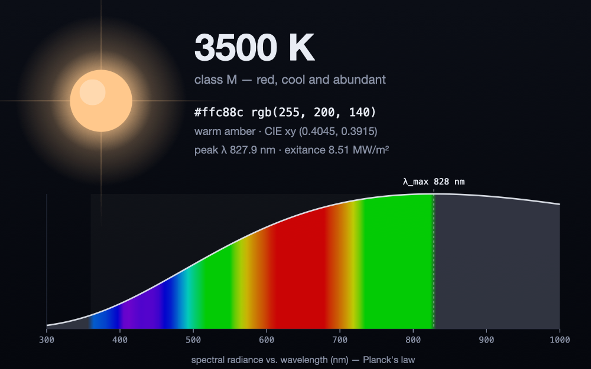

# starhue

**Temperature → the color of a star, plus its Planck spectrum.**

`starhue` takes a temperature value in kelvin, and returns the actual sRGB color that a
blackbody of that temperature would show to your eye. 

<p align="center">
  
</p>

---

## Quick start

The project folder *is* the `starhue` package, so you can run it straight from
source — from the directory that **contains** `starhue/`:

```bash
python -m starhue 5772            # the Sun
python -m starhue 3500 5772 12100 # several stars at once
python -m starhue --from-color '#ffd1a3'   # inverse: a color → its nearest blackbody
python -m starhue 5772 --no-spectrum       # card without the sparkline
```

```text
╭────────────────────────────────────────────────╮
│ ★  5772 K                              class G  │
│ ████████  #fff1ea  rgb(255, 241, 234)          │
│ yellow, Sun-like · neutral white               │
│                                                │
│ peak λ    502.0 nm  ·  3.393e+14 Hz            │
│ exitance  62.94 MW/m²                          │
│                                                │
│ ▄▄▅▆▆▇▇▇██████████▇▇▇▇▇▆▆▆▆▆▅▅▅▅▅▄▄▄▄▄▄▃▃▃▃▃▃▃ │
│            ▲                                    │
│ 300nm                                   1100nm │
╰────────────────────────────────────────────────╯
```

*(In a real terminal the swatch and spectrum sparkline are full 24-bit color.)*

## Python API

```python
import starhue

# One-liners — pick the output format you want
starhue.temperature_to_color(5772)          # '#fff1ea'        (hex by default)
starhue.temperature_to_color(3500, 'rgb')   # (255, 200, 140)  (r, g, b), 0–255
starhue.wavelength_to_color(550, 'rgb')      # color of a single wavelength

# The high-level object
star = starhue.Star(5772)
star.hex                  # '#fff1ea'
star.rgb                  # (255, 241, 234)
star.peak_wavelength_nm   # 502.0     — Wien's displacement law
star.peak_frequency_hz    # 3.39e14   — frequency-form Wien's law
star.radiant_exitance     # 6.29e7 W/m²  — Stefan–Boltzmann
star.spectral_type.letter # 'G'
star.appearance           # 'neutral white'

# The raw spectrum: list of (wavelength_nm, radiance)
star.spectrum(380, 750, samples=100, normalize=True)
```

### Inverse: color → temperature (CCT)

Go the other way too. The correlated color temperature is the nearest point on
the Planckian locus in CIE 1960 *uv* space, so it round-trips with the forward
model. `color_to_temperature` takes the color as a `#rrggbb` string or an
`(r, g, b)` triple and returns the temperature in kelvin.

```python
starhue.color_to_temperature('#ffd1a3')        # 3911.0
starhue.color_to_temperature((205, 217, 255))  # ~10000

starhue.Star.from_color('#fff1ea')        # Star(5773 K, #fff1ea, class G)
starhue.Star.from_color((255, 200, 140))  # also takes an (r, g, b) triple
```

## Full API reference

These are the functions and objects you call. They're re-exported onto the
top-level `starhue` namespace, so `import starhue` is enough to reach all of
them; the table notes which submodule each lives in if you'd rather import from
there.

### Forward — temperature / wavelength → color

Each returns a `#rrggbb` string by default, or an `(r, g, b)` triple (0–255) with
`format="rgb"`.

| Name | Signature → returns | Description |
|---|---|---|
| `temperature_to_color` | `(temperature_k, format="hex", step_nm=1.0) → str \| (int, int, int)` | Color of a blackbody at this temperature (full colorimetric pipeline). |
| `wavelength_to_color` | `(wavelength_nm, format="hex") → str \| (int, int, int)` | Display color of a single monochromatic wavelength (a spectral ramp, for plots). |

### Inverse — color → temperature

| Name | Signature → returns | Description |
|---|---|---|
| `color_to_temperature` | `(color) → float` | Correlated color temperature (K) of a `#rrggbb` hex string or `(r, g, b)` triple — the nearest blackbody on the Planckian locus. |

### Color utilities

| Name | Signature → returns | Description |
|---|---|---|
| `hex_to_rgb` | `(value) → (int, int, int)` | Parse `#rgb`/`#rrggbb` → `(r, g, b)`, 0–255. |

### Physics

| Name | Signature → returns | Description |
|---|---|---|
| `planck` | `(wavelength_m, temperature_k) → float` | Planck spectral radiance, W·sr⁻¹·m⁻³ (wavelength in **metres**). |
| `planck_nm` | `(wavelength_nm, temperature_k) → float` | Planck spectral radiance per nm (wavelength in **nanometres**). |
| `spectrum` | `(temperature_k, lo_nm=300, hi_nm=1100, samples=200, *, normalize=False) → list[(float, float)]` | Sample the Planck curve → `(wavelength_nm, radiance)` pairs. |
| `wien_peak_wavelength` | `(temperature_k, unit="nm") → float` | Wavelength of peak radiance (Wien); **nm** by default, `unit="m"` for metres. |
| `wien_peak_frequency` | `(temperature_k) → float` | Frequency of peak radiance (frequency-form Wien), Hz. |
| `stefan_boltzmann` | `(temperature_k) → float` | Total radiant exitance σT⁴, W·m⁻². |

### Classification

| Name | Kind | Signature → returns | Description |
|---|---|---|---|
| `spectral_class` | function | `(temperature_k) → SpectralType` | Harvard spectral type (O/B/A/F/G/K/M) for an effective temperature. |
| `appearance_name` | function | `(temperature_k) → str` | Friendly perceptual color name, e.g. `"warm amber"`, as seen in a vacuum *(in `starhue.classify`)*. |
| `SpectralType` | object | `NamedTuple(letter, description)` | The value `spectral_class` returns — read `.letter` (e.g. `'G'`) and `.description` off it. |

### The `Star` object (`starhue.Star`)

`Star(temperature_k, *, color_step_nm=1.0)` — the high-level facade. The keyword
`color_step_nm` is the wavelength step (nm) of the color integration; smaller is
more accurate but slower.

**Inverse constructor** (color → nearest blackbody):

| Constructor | Signature → returns | Description |
|---|---|---|
| `Star.from_color` | `(color_value) → Star` | From either a `#rrggbb` hex string or an sRGB `(r, g, b)` triple (0–255). |

**Attributes, properties & methods:**

| Member | Kind | Type / returns | Description |
|---|---|---|---|
| `temperature` | attribute | `float` | The star's temperature, K. |
| `rgb` | property | `(int, int, int)` | Display sRGB color, 0–255. |
| `hex` | property | `str` | Display sRGB color as `#rrggbb`. |
| `peak_wavelength_nm` | property | `float` | Wien peak wavelength, nm. |
| `peak_frequency_hz` | property | `float` | Wien peak frequency (frequency form), Hz. |
| `radiant_exitance` | property | `float` | Stefan–Boltzmann exitance, W·m⁻². |
| `spectral_type` | property | `SpectralType` | Harvard spectral classification. |
| `appearance` | property | `str` | Friendly perceptual color name, e.g. `"neutral white"`. |
| `planck(wavelength_nm)` | method | `float` | Spectral radiance at a wavelength in nm. |
| `spectrum(lo_nm=300, hi_nm=1100, samples=200, *, normalize=False)` | method | `list[(float, float)]` | Sample the Planck curve → `(wavelength_nm, radiance)` pairs. |

Anything not listed here (the colorimetry conversion steps in `starhue.color`,
the physical constants in `starhue.constants`) is internal plumbing the functions
above build on — usable, but not the intended surface.

## The science

Everything is computed from first principles with the exact 2019-SI constants.

**Planck's law** — spectral radiance of a blackbody:

$$B_\lambda(T) = \frac{2hc^2}{\lambda^5}\,\frac{1}{\exp\!\left(\dfrac{hc}{\lambda k_B T}\right) - 1}$$

**Wien's displacement law** — where that curve peaks: $\lambda_\text{max} = b / T$.

**Stefan–Boltzmann law** — total power radiated per unit area: $j^\star = \sigma T^4$.

**Temperature → color** follows the standard colorimetry pipeline:

1. Sample the Planck curve across the visible band (360–830 nm).
2. Integrate against the **CIE 1931 2° color-matching functions** → CIE *XYZ*.
3. Map *XYZ* → linear sRGB with the D65 matrix.
4. Clamp out-of-gamut negatives, normalize to constant luminance, gamma-encode.

The color-matching functions use the analytic multi-lobe Gaussian fit of
**Wyman, Sloan & Shirley (2013)**, which reproduces the tabulated CIE curves to
within ~1% with no embedded data table.

### Is it accurate?

Yes — it lands on the textbook reference points:

| Temperature | `starhue` | meaning |
|------------:|:----------|:--------|
| 6500 K | xy ≈ (0.313, 0.324) | essentially the **D65** white point |
| 5772 K | `#fff1ea` | the Sun — a warm white, *not* yellow |
| 3500 K | `#ffc88c` | amber (an M-type red giant) |
| 12000 K | bluish white | hot B-type star |

The full Planckian locus matches Mitchell Charity's well-known blackbody-color
table closely.

## Gallery

A cool red giant — note the spectral peak sliding into the infrared:

<p align="center">
  
</p>

A hot blue star, peak pushed into the ultraviolet:

<p align="center">
  
</p>

## CLI reference

```
starhue [TEMPERATURES ...] [options]

positional:
  TEMPERATURES        one or more temperatures in kelvin (default: 5772, the Sun)

options:
  --no-spectrum       hide the spectrum sparkline in cards
  --from-color COLOR  inverse mode: a color (#rrggbb or r,g,b) → its nearest blackbody
  --color / --no-color   force or disable ANSI color (auto-detected by default)
  --version
```

```bash
starhue --from-color '#ffd1a3'   # what temperature is this color?
```

Color output honours the `NO_COLOR` and `FORCE_COLOR` conventions.

## Module map

| module | role |
|---|---|
| `constants` | exact SI / CODATA physical constants |
| `physics` | Planck's law, Wien's law, Stefan–Boltzmann, spectrum sampling |
| `color` | CIE 1931 CMF → XYZ → sRGB; chromaticity; wavelength → display color |
| `cct` | inverse direction: color → correlated color temperature |
| `classify` | Harvard spectral class + perceptual color names |
| `star` | the high-level `Star` object |
| `render` | terminal card + spectrum sparkline |
| `cli` | the command-line interface |

## References

- M. Planck, *On the Law of Distribution of Energy in the Normal Spectrum* (1901).
- CIE 1931 2° standard colorimetric observer.
- C. Wyman, P. Sloan & P. Shirley, *Simple Analytic Approximations to the CIE
  XYZ Color Matching Functions*, **JCGT** 2(2), 2013.
- IEC 61966-2-1:1999 (sRGB).
- M. Charity, *What color is a blackbody?* — reference color table.

## License

_To be decided by the project owner._
